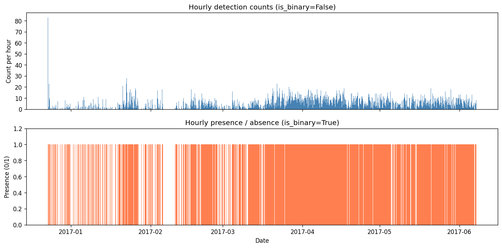
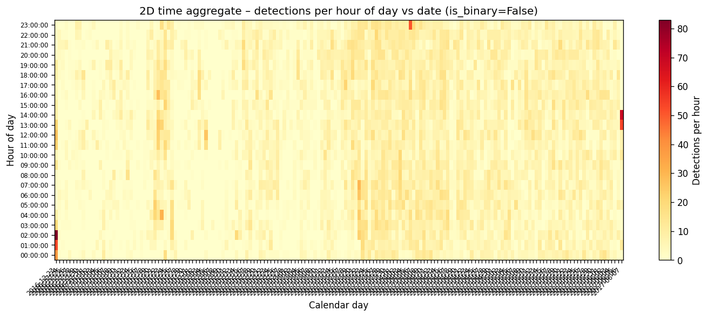
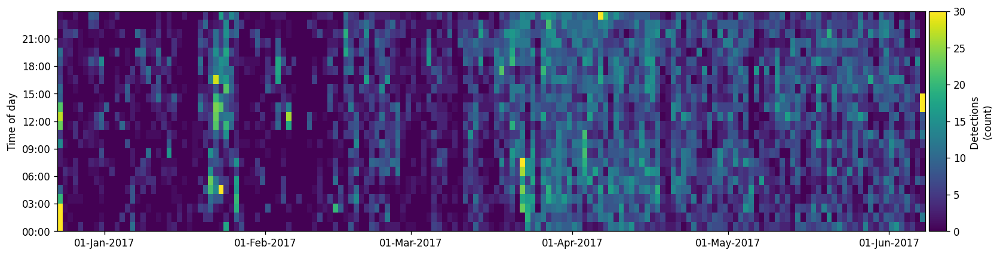

.. _tutorial_annotation:

Using the Annotation class
==========================

The :class:`~ecosound.core.annotation.Annotation` class is the central data
structure in ecosound. It stores acoustic annotation data from manual labelling
tools (Raven, PAMlab) and from automatic detectors and classifiers in a
standardised pandas DataFrame. This tutorial walks through the most common
operations: importing, exporting, inspecting, filtering, combining, and
visualising annotation data.

The example data files referenced below are located in the ``data/``
directory of the ecosound repository. Adjust the paths to match your local
file system.

.. contents:: In this tutorial
   :local:
   :depth: 2

----

Creating an Annotation object
------------------------------

An empty :class:`~ecosound.core.annotation.Annotation` object is created by
calling the constructor with no arguments. It initialises a DataFrame with all
35 standard annotation fields set to empty typed columns.

.. code-block:: python

   from ecosound.core.annotation import Annotation

   annot = Annotation()
   print(annot)
   print(len(annot))

.. code-block:: text

   Annotation object (0)
   0

----

Importing annotations
----------------------

From a Raven selection table
~~~~~~~~~~~~~~~~~~~~~~~~~~~~~

Raven Pro saves annotations as tab-delimited ``.txt`` selection tables. Pass a
file path, a list of paths, or a directory path to
:meth:`~ecosound.core.annotation.Annotation.from_raven`. When a directory is
given, all ``.txt`` files inside it are imported.

The ``class_header`` argument specifies which Raven column to use as the class
label. Open the Raven file in a text editor to identify the correct column
name (common values are ``'Class'``, ``'Sound type'``, ``'Call Type'``, etc.).

.. code-block:: python

   from ecosound.core.annotation import Annotation

   raven_file = r'data/Raven_annotations/AMAR173.4.20190916T061248Z.Table.1.selections.txt'

   annot = Annotation()
   annot.from_raven(raven_file, class_header='Sound type', verbose=True)

.. code-block:: text

   Duplicate entries removed: 557
   Integrity test successful
   557 annotations imported.

To import several files at once, pass a list:

.. code-block:: python

   raven_files = [
       r'data/Raven_annotations/AMAR173.4.20190916T061248Z.Table.1.selections.txt',
       r'data/Raven_annotations/67674121.181018013806.Table.1.selections.txt',
   ]

   annot = Annotation()
   annot.from_raven(raven_files, class_header='Class', verbose=True)

From a PAMlab annotation log
~~~~~~~~~~~~~~~~~~~~~~~~~~~~~

PAMlab saves annotations as ``.log`` files. The usage mirrors
:meth:`~ecosound.core.annotation.Annotation.from_raven`: pass a single path,
a list of paths, or a directory.

.. code-block:: python

   from ecosound.core.annotation import Annotation

   pamlab_file = r'data/PAMlab_annotations/AMAR173.4.20190916T061248Z.wav annotations.log'

   annot = Annotation()
   annot.from_pamlab(pamlab_file, verbose=True)

From a SQLite database
~~~~~~~~~~~~~~~~~~~~~~~

Ecosound can read annotation data stored in SQLite databases.
Pass a single file path, a list of paths, or a folder path.

.. code-block:: python

   from ecosound.core.annotation import Annotation

   sqlite_file = r'data/sqlite_annotations/read/detections1.sqlite'

   annot = Annotation()
   annot.from_sqlite(sqlite_file, verbose=True)

.. code-block:: text

   Duplicate entries removed: 0
   Integrity test successful
   19240 annotations imported.

To merge two databases in one step, pass a list:

.. code-block:: python

   sqlite_files = [
       r'data/sqlite_annotations/read/detections1.sqlite',
       r'data/sqlite_annotations/read/detections2.sqlite',
   ]

   annot = Annotation()
   annot.from_sqlite(sqlite_files, verbose=True)

.. code-block:: text

   Duplicate entries removed: 19240
   Integrity test successful
   19240 annotations imported.

.. note::

   When a list of SQLite files is passed, duplicate rows (same annotation
   appearing in multiple files) are automatically removed during the integrity
   check.

From a NetCDF file
~~~~~~~~~~~~~~~~~~~

NetCDF (``.nc``) is the recommended format for large annotation datasets
because it preserves all data types and supports efficient reading with
xarray and Dask.

.. code-block:: python

   from ecosound.core.annotation import Annotation

   netcdf_file = r'path/to/annotations.nc'

   annot = Annotation()
   annot.from_netcdf(netcdf_file, verbose=True)

From a Parquet file
~~~~~~~~~~~~~~~~~~~~

.. code-block:: python

   from ecosound.core.annotation import Annotation

   parquet_file = r'path/to/annotations.parquet'

   annot = Annotation()
   annot.from_parquet(parquet_file, verbose=True)

----

Inspecting annotations
-----------------------

Once data are loaded, several methods help explore the contents.

.. code-block:: python

   from ecosound.core.annotation import Annotation

   annot = Annotation()
   annot.from_raven(
       r'data/Raven_annotations/AMAR173.4.20190916T061248Z.Table.1.selections.txt',
       class_header='Sound type',
   )

   print(len(annot))
   print(annot)

.. code-block:: text

   557
   557 annotation(s)

.. code-block:: python

   print(annot.get_fields())

.. code-block:: text

   ['uuid', 'from_detector', 'software_name', 'software_version',
    'operator_name', 'UTC_offset', 'entry_date', 'audio_channel',
    'audio_file_name', 'audio_file_dir', 'audio_file_extension',
    'audio_file_start_date', 'audio_sampling_frequency', 'audio_bit_depth',
    'mooring_platform_name', 'recorder_type', 'recorder_SN',
    'hydrophone_model', 'hydrophone_SN', 'hydrophone_depth', 'location_name',
    'location_lat', 'location_lon', 'location_water_depth', 'deployment_ID',
    'frequency_min', 'frequency_max', 'time_min_offset', 'time_max_offset',
    'time_min_date', 'time_max_date', 'duration', 'label_class',
    'label_subclass', 'confidence']

.. code-block:: python

   print('Class labels:', annot.get_labels_class())

.. code-block:: text

   Class labels: ['Seal', 'FS', ' ', 'Unknown']

.. code-block:: python

   print(annot.summary(rows='label_class', columns='audio_file_name'))

.. code-block:: text

   audio_file_name  AMAR173.4.20190916T061248Z  Total
   label_class
                                             1      1
   FS                                      554    554
   Seal                                      1      1
   Unknown                                   1      1
   Total                                   557    557

Direct access to the underlying pandas DataFrame is available through the
``data`` attribute:

.. code-block:: python

   print(annot.data[['duration', 'frequency_min', 'frequency_max']].describe().round(3))

.. code-block:: text

          duration  frequency_min  frequency_max
   count   557.000        557.000        557.000
   mean      0.139          1.310        419.752
   std       0.184         12.305        134.811
   min       0.000          0.000        175.000
   25%       0.067          0.000        359.400
   50%       0.086          0.000        409.400
   75%       0.135          0.000        456.200
   max       3.185        274.000       2478.000

----

Exporting annotations
----------------------

To a Raven selection table
~~~~~~~~~~~~~~~~~~~~~~~~~~~

:meth:`~ecosound.core.annotation.Annotation.to_raven` writes one ``.txt``
file per audio recording (default) or a single combined file.

.. code-block:: python

   import os

   output_dir = r'path/to/output'
   os.makedirs(output_dir, exist_ok=True)

   # One output file per audio recording (default)
   annot.to_raven(output_dir, single_file=False)

   # All annotations in a single file
   annot.to_raven(output_dir, single_file=True, outfile='all_annotations.txt')

The exported file uses the standard Raven tab-delimited format:

.. code-block:: text

   Selection  View           Channel  Begin Time (s)  End Time (s)  ...  Class   Sound type
   1          Spectrogram 1  1        9.753681034     9.984592044   ...  fish    0
   2          Spectrogram 1  1        10.825108118    11.074492008  ...  fish?   0
   ...

To a PAMlab annotation log
~~~~~~~~~~~~~~~~~~~~~~~~~~~

.. code-block:: python

   annot.to_pamlab(output_dir, single_file=False)

To a SQLite database
~~~~~~~~~~~~~~~~~~~~~

.. code-block:: python

   annot.to_sqlite(r'path/to/output/annotations.sqlite')

To NetCDF, Parquet, and CSV
~~~~~~~~~~~~~~~~~~~~~~~~~~~~

.. code-block:: python

   annot.to_netcdf(r'path/to/output/annotations.nc')
   annot.to_parquet(r'path/to/output/annotations.parquet')
   annot.to_csv(r'path/to/output/annotations.csv')

----

Combining multiple Annotation objects
---------------------------------------

The ``+`` operator concatenates two
:class:`~ecosound.core.annotation.Annotation` objects and returns a new
object containing all their rows.

.. code-block:: python

   from ecosound.core.annotation import Annotation

   annot1 = Annotation()
   annot1.from_raven(
       r'data/Raven_annotations/AMAR173.4.20190916T061248Z.Table.1.selections.txt',
       class_header='Sound type',
   )

   annot2 = Annotation()
   annot2.from_raven(
       r'data/Raven_annotations/67674121.181018013806.Table.1.selections.txt',
       class_header='Class',
   )

   print('len(annot1) =', len(annot1))
   print('len(annot2) =', len(annot2))

   annot_all = annot1 + annot2
   print('len(annot1 + annot2) =', len(annot_all))
   print(annot_all.summary(rows='label_class', columns='audio_file_name'))

.. code-block:: text

   len(annot1) = 557
   len(annot2) = 773
   len(annot1 + annot2) = 1330

   audio_file_name  67674121.181018013806  AMAR173.4.20190916T061248Z  Total
   label_class
                                        0                           1      1
   ?                                    2                           0      2
   FS                                   0                         554    554
   Seal                                 0                           1      1
   Unknown                              0                           1      1
   fish                               757                           0    757
   fish?                               14                           0     14
   Total                              773                         557   1330

----

Inserting and updating metadata
---------------------------------

Setting field values manually
~~~~~~~~~~~~~~~~~~~~~~~~~~~~~~~

:meth:`~ecosound.core.annotation.Annotation.insert_values` sets one or more
annotation fields to a given value across all rows. This is useful when a
field is not populated by the import format.

.. code-block:: python

   annot.insert_values(
       operator_name='Jane Smith',
       UTC_offset=-8.0,
       audio_channel=0,
   )

   print('operator_name:', annot.data['operator_name'].iloc[0])
   print('UTC_offset   :', annot.data['UTC_offset'].iloc[0])
   print('audio_channel:', annot.data['audio_channel'].iloc[0])

.. code-block:: text

   operator_name: Jane Smith
   UTC_offset   : -8.0
   audio_channel: 0

Loading deployment metadata from a CSV file
~~~~~~~~~~~~~~~~~~~~~~~~~~~~~~~~~~~~~~~~~~~~~

:meth:`~ecosound.core.annotation.Annotation.insert_metadata` reads a
deployment CSV file (see :class:`~ecosound.core.metadata.DeploymentInfo`)
and copies the recorder, hydrophone, and location information into the
annotation DataFrame.

.. code-block:: python

   annot.insert_metadata(
       deployment_info_file=r'path/to/deployment_info.csv',
       channel=0,
   )

----

Checking data integrity
------------------------

:meth:`~ecosound.core.annotation.Annotation.check_integrity` validates the
annotation DataFrame, removes duplicate rows, and ensures that start times
are before stop times and minimum frequencies are below maximum frequencies.

.. code-block:: python

   import pandas as pd
   from ecosound.core.annotation import Annotation

   annot = Annotation()
   annot.from_raven(
       r'data/Raven_annotations/67674121.181018013806.Table.1.selections.txt',
       class_header='Class',
       verbose=False,
   )

   # Manually introduce 10 duplicate rows to demonstrate
   annot.data = pd.concat([annot.data, annot.data.head(10)], ignore_index=True)
   print('Before check_integrity:', len(annot))

   annot.check_integrity(verbose=True)
   print('After check_integrity :', len(annot))

.. code-block:: text

   Before check_integrity: 783
   Duplicate entries removed: 10
   Integrity test successful
   After check_integrity : 773

----

Filtering annotations
----------------------

By attribute value
~~~~~~~~~~~~~~~~~~~

:meth:`~ecosound.core.annotation.Annotation.filter` keeps only rows that
satisfy a pandas query string.

.. code-block:: python

   from ecosound.core.annotation import Annotation

   annot = Annotation()
   annot.from_sqlite(r'data/sqlite_annotations/read/detections1.sqlite', verbose=False)

   print('Total detections:', len(annot))
   print('Labels          :', annot.get_labels_class())

   # Keep only high-confidence detections
   annot_hq = annot.filter(query_str='confidence >= 0.9', inplace=False)
   print('Detections with confidence >= 0.9:', len(annot_hq))

   # Keep only detections lasting at least 1 second
   annot_long = annot.filter(query_str='duration >= 1.0', inplace=False)
   print('Detections with duration >= 1.0 s :', len(annot_long))

.. code-block:: text

   Total detections: 19240
   Labels          : ['MW']
   Detections with confidence >= 0.9: 3444
   Detections with duration >= 1.0 s : 19240

By overlap with a reference annotation set
~~~~~~~~~~~~~~~~~~~~~~~~~~~~~~~~~~~~~~~~~~~

:meth:`~ecosound.core.annotation.Annotation.filter_overlap_with` is used to
evaluate automatic detections against manual annotations. It keeps only
detections that overlap in time (and optionally frequency) with a reference
annotation set, discarding false alarms.

The method is typically called on a
:class:`~ecosound.core.measurement.Measurement` object (detections) with a
reference :class:`~ecosound.core.annotation.Annotation` object (ground truth).

Key parameters:

* ``freq_ovp`` — also require frequency-band overlap (default ``True``).
* ``ovlp_ratio_min`` — minimum fraction of annotation duration covered by the
  detection (e.g. ``0.3`` = 30 %).
* ``dur_factor_min`` / ``dur_factor_max`` — reject detections whose duration is
  too short or too long relative to the annotation.
* ``remove_duplicates`` — keep only the best-matching detection per annotation.
* ``inherit_metadata`` — copy class label and deployment metadata from the
  matching annotation into the detection.

.. code-block:: python

   from ecosound.core.annotation import Annotation
   from ecosound.core.measurement import Measurement

   # Load ground-truth annotations
   annot = Annotation()
   annot.from_raven(r'path/to/manual_annotations.txt', class_header='Class')

   # Load automatic detections
   detec = Measurement()
   detec.from_netcdf(r'path/to/detections.nc')

   print('Detections before filtering:', len(detec))

   detec.filter_overlap_with(
       annot,
       freq_ovp=True,          # require frequency overlap
       ovlp_ratio_min=0.3,     # ≥ 30 % temporal overlap required
       dur_factor_min=0.1,     # detection must be ≥ 10 % of annotation duration
       dur_factor_max=None,    # no upper limit on duration ratio
       remove_duplicates=True, # keep best-matching detection per annotation
       inherit_metadata=True,  # copy label and deployment info from annotation
       filter_deploymentID=False,
       inplace=True,
   )

   print('Detections after filtering (true positives):', len(detec))
   detec.to_netcdf(r'path/to/true_positives.nc')

----

Time aggregation
-----------------

The time-aggregation methods bin annotations into regular time windows and
compute counts or binary presence. They return standard pandas DataFrames.

Pandas `offset aliases
<https://pandas.pydata.org/pandas-docs/stable/user_guide/timeseries.html#offset-aliases>`_
define the window size: ``'1h'`` = 1 hour, ``'30min'`` = 30 minutes,
``'1D'`` = 1 day, etc.

1D aggregation — counts or presence over time
~~~~~~~~~~~~~~~~~~~~~~~~~~~~~~~~~~~~~~~~~~~~~~

:meth:`~ecosound.core.annotation.Annotation.calc_time_aggregate_1D` returns a
one-column DataFrame indexed by datetime.

* ``is_binary=False`` (default): each bin contains the **count** of
  annotations.
* ``is_binary=True``: each bin contains **1** (present) or **0** (absent).

.. code-block:: python

   from ecosound.core.annotation import Annotation

   annot = Annotation()
   annot.from_sqlite(r'data/sqlite_annotations/read/detections1.sqlite', verbose=False)

   # Hourly detection counts
   agg_counts = annot.calc_time_aggregate_1D(integration_time='1h', is_binary=False)
   print('Hourly counts (first 6 rows):')
   print(agg_counts.head(6))

   # Hourly presence/absence
   agg_presence = annot.calc_time_aggregate_1D(integration_time='1h', is_binary=True)
   print('Hourly presence/absence (first 6 rows):')
   print(agg_presence.head(6))

.. code-block:: text

   Hourly counts (first 6 rows):
                        value
   datetime
   2016-12-23 00:00:00     38
   2016-12-23 01:00:00     53
   2016-12-23 02:00:00     83
   2016-12-23 03:00:00     20
   2016-12-23 04:00:00      9
   2016-12-23 05:00:00      0

   Hourly presence/absence (first 6 rows):
                        value
   datetime
   2016-12-23 00:00:00      1
   2016-12-23 01:00:00      1
   2016-12-23 02:00:00      1
   2016-12-23 03:00:00      1
   2016-12-23 04:00:00      1
   2016-12-23 05:00:00      0

   Hourly detection counts (top) and hourly presence/absence (bottom) derived
   from ``detections1.sqlite``.

2D aggregation — daily pattern (time-of-day vs date)
~~~~~~~~~~~~~~~~~~~~~~~~~~~~~~~~~~~~~~~~~~~~~~~~~~~~~~

:meth:`~ecosound.core.annotation.Annotation.calc_time_aggregate_2D` returns a
2D DataFrame with time-of-day as the row index and calendar date as columns.
This is ideal for visualising diel (24-hour) activity patterns across multiple
days.

.. code-block:: python

   agg_2D = annot.calc_time_aggregate_2D(integration_time='1h', is_binary=False)
   print('Shape:', agg_2D.shape, ' (time-of-day bins × calendar days)')
   print(agg_2D.iloc[:5, :5])

.. code-block:: text

   Shape: (24, 167)  (time-of-day bins × calendar days)

   date      2016-12-23  2016-12-24  2016-12-25  2016-12-26  2016-12-27
   time
   00:00:00        38.0         1.0         0.0         0.0         4.0
   01:00:00        53.0         0.0         1.0         0.0         0.0
   02:00:00        83.0         1.0         0.0         0.0         0.0
   03:00:00        20.0         0.0         1.0         1.0         1.0
   04:00:00         9.0         1.0         0.0         2.0         0.0

   2D time aggregate: detection count per hour of day (y-axis) vs calendar
   date (x-axis) over 167 days of monitoring data.

----

Visualising with a heatmap
---------------------------

:meth:`~ecosound.core.annotation.Annotation.heatmap` generates a 2D heatmap
of detection activity (time of day vs date). The ``norm_value`` parameter
caps the colour scale so that a single dense period does not dominate the
colour range.

.. code-block:: python

   import matplotlib.pyplot as plt
   from ecosound.core.annotation import Annotation

   annot = Annotation()
   annot.from_sqlite(r'data/sqlite_annotations/read/detections1.sqlite', verbose=False)

   annot.heatmap(
       norm_value=30,
       integration_time='1h',
       is_binary=False,
   )
   plt.savefig(r'path/to/output/heatmap.png', dpi=150)
   plt.show()

   Heatmap of minke whale detection activity. Colour intensity represents the
   number of detections per hour, capped at 30 (``norm_value=30``).

----

Updating audio file paths
--------------------------

When audio files are moved to a different directory after annotations have been
saved, :meth:`~ecosound.core.annotation.Annotation.update_audio_dir` searches
the new directory recursively and updates the ``audio_file_dir`` field.

.. code-block:: python

   from ecosound.core.annotation import Annotation

   annot = Annotation()
   annot.from_netcdf(r'path/to/annotations.nc')

   missing = annot.update_audio_dir(
       new_data_dir=r'D:/new_audio_location',
       verbose=True,
   )

   if missing:
       print(f'{len(missing)} audio file(s) could not be found:')
       for f in missing:
           print(' ', f)
   else:
       annot.to_netcdf(r'path/to/updated_annotations.nc')

----

Merging overlapping detections
--------------------------------

:meth:`~ecosound.core.annotation.Annotation.merge_overlapped` merges short
overlapping detections for the same sound event into a single longer detection.
``time_tolerance_sec`` sets the maximum allowed gap between detections that
are still considered part of the same event.

.. code-block:: python

   from ecosound.core.annotation import Annotation

   annot = Annotation()
   annot.from_raven(r'path/to/detections.txt', class_header='Class')

   print('Before merging:', len(annot))
   annot.merge_overlapped(time_tolerance_sec=0.5, inplace=True)
   print('After merging :', len(annot))

----

Complete workflow example
--------------------------

The following example shows a typical end-to-end workflow: loading Raven
annotations, running an integrity check, adding metadata, filtering by class,
computing a time aggregate, and saving the result.

.. code-block:: python

   import matplotlib.pyplot as plt
   from ecosound.core.annotation import Annotation

   # 1. Load annotations from two Raven selection tables
   annot1 = Annotation()
   annot1.from_raven(
       r'data/Raven_annotations/AMAR173.4.20190916T061248Z.Table.1.selections.txt',
       class_header='Sound type',
       verbose=True,
   )
   annot2 = Annotation()
   annot2.from_raven(
       r'data/Raven_annotations/67674121.181018013806.Table.1.selections.txt',
       class_header='Class',
       verbose=True,
   )
   annot = annot1 + annot2
   print(f'Loaded {len(annot)} annotations')

   # 2. Add metadata
   annot.insert_values(
       operator_name='Jane Smith',
       UTC_offset=-8.0,
       location_name='British Columbia',
       location_lat=49.52,
       location_lon=-124.68,
   )

   # 3. Inspect labels and cross-tabulation
   print('Class labels:', annot.get_labels_class())
   print(annot.summary(rows='label_class', columns='audio_file_name'))

   # 4. Filter to a single class
   annot_fish = annot.filter(query_str='label_class == "fish"', inplace=False)
   print(f'Fish annotations: {len(annot_fish)}')

   # 5. Save to NetCDF
   annot_fish.to_netcdf(r'path/to/output/fish_annotations.nc')

   # 6. Load from SQLite and visualise as a heatmap
   detec = Annotation()
   detec.from_sqlite(r'data/sqlite_annotations/read/detections1.sqlite', verbose=True)
   detec.heatmap(norm_value=20, integration_time='1h', is_binary=False)
   plt.savefig(r'path/to/output/heatmap.png', dpi=150)
   plt.show()
