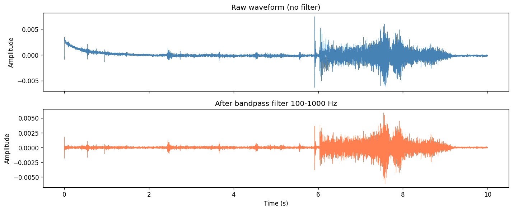
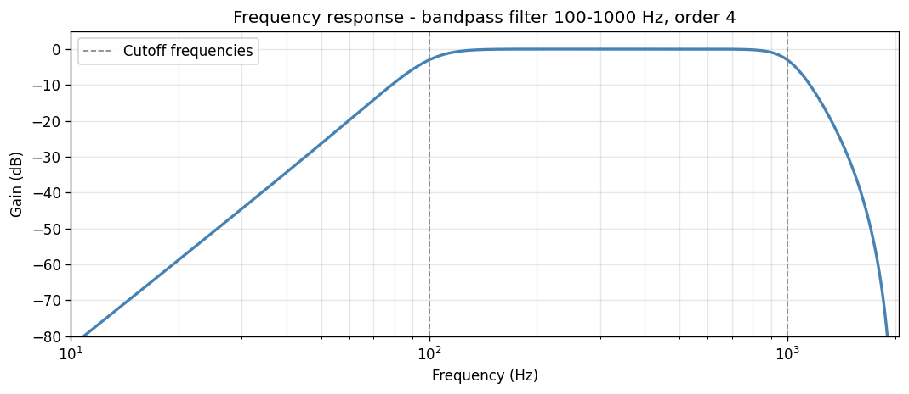

Audio Tools Tutorial
====================

.. contents:: Contents
   :local:
   :depth: 2

This tutorial covers the :mod:`ecosound.core.audiotools` module, which provides
three main components:

- :class:`~ecosound.core.audiotools.Sound` — load, read, filter, and manipulate
  audio waveforms from WAV files.
- :class:`~ecosound.core.audiotools.Filter` — design digital filters that can
  be applied to Sound objects.
- :func:`~ecosound.core.audiotools.upsample` — resample a waveform array to a
  higher sampling frequency.

The examples below use the file ``AMAR173.4.20190916T061248Z.wav`` (30-minute
AMAR hydrophone recording, 4096 Hz, single channel) from the ``data/wav_files/``
directory.

.. code-block:: python

   from ecosound.core.audiotools import Sound, Filter, upsample

   WAV = 'data/wav_files/AMAR173.4.20190916T061248Z.wav'

Sound class
-----------

Creating a Sound object
~~~~~~~~~~~~~~~~~~~~~~~

Instantiate a :class:`~ecosound.core.audiotools.Sound` object by passing the
path to a WAV file.  The constructor reads file-level metadata but does **not**
load any audio data into memory.

.. code-block:: python

   sound = Sound(WAV)
   print('file_dir              :', sound.file_dir)
   print('file_name             :', sound.file_name)
   print('file_extension        :', sound.file_extension)
   print('file_duration_sec     :', round(sound.file_duration_sec, 3), 's')
   print('file_duration_sample  :', sound.file_duration_sample, 'samples')
   print('file_sampling_frequency:', sound.file_sampling_frequency, 'Hz')
   print('channels              :', sound.channels)

.. code-block:: text

   file_dir              : .../data/wav_files
   file_name             : AMAR173.4.20190916T061248Z
   file_extension        : .wav
   file_duration_sec     : 1799.003 s
   file_duration_sample  : 7368716 samples
   file_sampling_frequency: 4096 Hz
   channels              : 1

Reading audio data
~~~~~~~~~~~~~~~~~~

Call :meth:`~ecosound.core.audiotools.Sound.read` to load audio samples into
memory.  You can read the entire file or a time chunk specified in seconds
(``unit='sec'``) or samples (``unit='samp'``).

**Reading the whole file:**

.. code-block:: python

   sound.read(channel=0, chunk=[], unit='sec', detrend=True)
   print('waveform shape             :', sound.waveform.shape)
   print('waveform_sampling_frequency:', sound.waveform_sampling_frequency, 'Hz')
   print('waveform_start_sample      :', sound.waveform_start_sample)
   print('waveform_stop_sample       :', sound.waveform_stop_sample)
   print('waveform_duration_sec      :', round(sound.waveform_duration_sec, 3), 's')

.. code-block:: text

   waveform shape             : (7368716,)
   waveform_sampling_frequency: 4096 Hz
   waveform_start_sample      : 0
   waveform_stop_sample       : 7368715
   waveform_duration_sec      : 1799.003 s

**Reading a 10-second chunk:**

.. code-block:: python

   sound.read(channel=0, chunk=[0, 10], unit='sec', detrend=True)
   print('waveform shape        :', sound.waveform.shape)
   print('waveform_start_sample :', sound.waveform_start_sample)
   print('waveform_stop_sample  :', sound.waveform_stop_sample)
   print('waveform_duration_sec :', round(sound.waveform_duration_sec, 3), 's')

.. code-block:: text

   waveform shape        : (40960,)
   waveform_start_sample : 0
   waveform_stop_sample  : 40960
   waveform_duration_sec : 10.0 s

Filtering
~~~~~~~~~

Apply a digital filter directly to the loaded waveform using
:meth:`~ecosound.core.audiotools.Sound.filter`.  The ``filter_applied``
attribute records whether a filter has been applied.

.. code-block:: python

   sound.read(channel=0, chunk=[0, 30], unit='sec', detrend=True)
   print('filter_applied before:', sound.filter_applied)
   sound.filter('bandpass', [100, 1000], order=4)
   print('filter_applied after :', sound.filter_applied)

.. code-block:: text

   filter_applied before: False
   filter_applied after : True

The figure below compares the raw waveform with the bandpass-filtered (100–1000 Hz)
version over the first 10 seconds:

   Raw waveform (top) and after applying a 4th-order Butterworth bandpass
   filter from 100 to 1000 Hz (bottom).

Selecting a snippet
~~~~~~~~~~~~~~~~~~~

:meth:`~ecosound.core.audiotools.Sound.select_snippet` extracts a time window
from the already-loaded waveform and returns a new :class:`Sound` object without
re-reading the file.

.. code-block:: python

   sound.read(channel=0, chunk=[0, 30], unit='sec', detrend=True)
   snippet = sound.select_snippet([5, 10], unit='sec')
   print('snippet.waveform_duration_sec:', round(snippet.waveform_duration_sec, 3))
   print('snippet.waveform_start_sample :', snippet.waveform_start_sample)
   print('snippet.waveform shape        :', snippet.waveform.shape)

.. code-block:: text

   snippet.waveform_duration_sec: 5.0
   snippet.waveform_start_sample : 20480
   snippet.waveform shape        : (20480,)

Normalizing
~~~~~~~~~~~

:meth:`~ecosound.core.audiotools.Sound.normalize` scales the waveform amplitude
in-place.  With ``method='amplitude'`` the waveform is rescaled so that the
maximum absolute value equals 1.

.. code-block:: python

   s = Sound(WAV)
   s.read(channel=0, chunk=[0, 5], unit='sec', detrend=True)
   print('max abs before normalize:', round(float(np.max(np.abs(s.waveform))), 6))
   s.normalize(method='amplitude')
   print('max abs after  normalize:', round(float(np.max(np.abs(s.waveform))), 6))

.. code-block:: text

   max abs before normalize: 0.003333
   max abs after  normalize: 1.0

Tightening the waveform window
~~~~~~~~~~~~~~~~~~~~~~~~~~~~~~~

:meth:`~ecosound.core.audiotools.Sound.tighten_waveform_window` trims the
waveform to the shortest window that contains a given percentage of the total
signal energy.  This is useful for isolating the active portion of a call from
surrounding silence.

.. code-block:: python

   s = Sound(WAV)
   s.read(channel=0, chunk=[0, 30], unit='sec', detrend=True)
   print('Duration before tighten:', round(s.waveform_duration_sec, 3), 's')
   s.tighten_waveform_window(energy_percentage=80)
   print('Duration after  tighten (80%):', round(s.waveform_duration_sec, 3), 's')

.. code-block:: text

   Duration before tighten: 30.0 s
   Duration after  tighten (80%): 28.817 s

Filter class
------------

:class:`~ecosound.core.audiotools.Filter` encapsulates a digital filter design
independently of any audio data.  The filter can then be passed to
:meth:`Sound.filter` or its coefficients can be retrieved for direct use with
SciPy.

.. code-block:: python

   filt = Filter('bandpass', [100, 1000], order=4)
   print('type               :', filt.type)
   print('cutoff_frequencies :', filt.cutoff_frequencies)
   print('order              :', filt.order)
   sos = filt.coefficients(4096)       # pass the sampling frequency in Hz
   print('coefficients shape :', sos.shape, '(second-order sections)')

.. code-block:: text

   type               : bandpass
   cutoff_frequencies : [100, 1000]
   order              : 4
   coefficients shape : (4, 6) (second-order sections)

The frequency response of this filter looks like:

   Frequency response of a 4th-order Butterworth bandpass filter from 100 to
   1000 Hz (sampling rate 4096 Hz).

upsample
--------

:func:`~ecosound.core.audiotools.upsample` resamples a 1-D waveform array to a
higher sampling frequency using ``scipy.signal.resample``.  It takes the raw
waveform array, the current time resolution (1 / current_fs), and the desired
new time resolution (1 / new_fs).

.. code-block:: python

   s = Sound(WAV)
   s.read(channel=0, chunk=[0, 5], unit='sec', detrend=True)
   print('Original fs  :', s.waveform_sampling_frequency, 'Hz')
   print('Original len :', len(s.waveform), 'samples')

   up_waveform, up_fs = upsample(
       s.waveform,
       1 / s.waveform_sampling_frequency,   # current resolution in seconds
       1 / 8192,                             # target resolution → 8192 Hz
   )
   print('Upsampled fs :', up_fs, 'Hz')
   print('Upsampled len:', len(up_waveform), 'samples')

.. code-block:: text

   Original fs  : 4096 Hz
   Original len : 20480 samples
   Upsampled fs : 8192 Hz
   Upsampled len: 40958 samples

.. tip::

   You can also upsample in-place via the :meth:`Sound.upsample` method, which
   accepts a single ``resolution_sec`` argument and updates the Sound object's
   waveform and sampling-frequency attributes directly.
