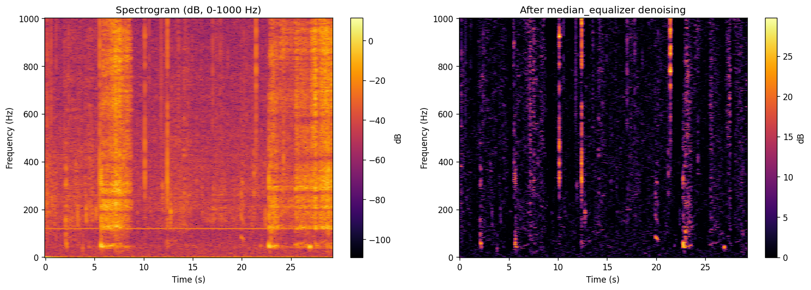

Spectrogram Tutorial
====================

.. contents:: Contents
   :local:
   :depth: 2

The :class:`~ecosound.core.spectrogram.Spectrogram` class computes short-time
Fourier transform (STFT) spectrograms from :class:`~ecosound.core.audiotools.Sound`
objects.  It supports flexible parameterisation in samples or seconds, frequency
cropping, and built-in denoising.

.. code-block:: python

   from ecosound.core.audiotools import Sound
   from ecosound.core.spectrogram import Spectrogram

   WAV = 'data/wav_files/AMAR173.4.20190916T061248Z.wav'
   sound = Sound(WAV)
   sound.read(channel=0, chunk=[0, 30], unit='sec', detrend=True)

Creating a Spectrogram object
-----------------------------

Instantiate :class:`~ecosound.core.spectrogram.Spectrogram` by specifying the
STFT frame length, FFT size, and step (hop) size.  Set ``unit='samp'`` to give
these in samples, or ``unit='sec'`` to use seconds.

.. code-block:: python

   spectro = Spectrogram(
       frame=3000,
       window_type='hann',
       fft=4096,
       step=500,
       sampling_frequency=sound.waveform_sampling_frequency,
       unit='samp',
       verbose=True,
   )
   print('frame_samp      :', spectro.frame_samp)
   print('fft_samp        :', spectro.fft_samp)
   print('step_samp       :', spectro.step_samp)
   print('frame_sec       :', round(spectro.frame_sec, 5), 's')
   print('step_sec        :', round(spectro.step_sec, 5), 's')
   print('freq_resolution :', round(spectro.frequency_resolution, 4), 'Hz')
   print('time_resolution :', round(spectro.time_resolution, 5), 's')

.. code-block:: text

   frame_samp      : 3000
   fft_samp        : 4096
   step_samp       : 500
   frame_sec       : 0.73242 s
   step_sec        : 0.12207 s
   freq_resolution : 1.0 Hz
   time_resolution : 0.12207 s

Computing the spectrogram
-------------------------

Call :meth:`~ecosound.core.spectrogram.Spectrogram.compute` to run the STFT on
a loaded :class:`Sound` object.  Use ``dB=True`` to return values in decibels.

.. code-block:: python

   spectro.compute(sound, dB=True, use_dask=False)
   print('spectrogram shape   :', spectro.spectrogram.shape, '(freq bins x time bins)')
   print('axis_frequencies[:5]:', np.round(spectro.axis_frequencies[:5], 2), 'Hz')
   print('axis_times[:5]      :', np.round(spectro.axis_times[:5], 4), 's')

.. code-block:: text

   spectrogram shape   : (2048, 240) (freq bins x time bins)
   axis_frequencies[:5]: [0. 1. 2. 3. 4.] Hz
   axis_times[:5]      : [0.     0.1221 0.2441 0.3662 0.4883] s

The spectrogram matrix has shape ``(n_freq_bins, n_time_bins)``.  The
attributes ``axis_frequencies`` and ``axis_times`` provide the corresponding
frequency (Hz) and time (s) axes.

Cropping in frequency
---------------------

:meth:`~ecosound.core.spectrogram.Spectrogram.crop` returns a new
:class:`Spectrogram` (or modifies in-place when ``inplace=True``) restricted to
a frequency band of interest.

.. code-block:: python

   spec_c = spectro.crop(frequency_min=0, frequency_max=1000, inplace=False)
   print('Original freq range:', round(spectro.axis_frequencies[0],1),
         '-', round(spectro.axis_frequencies[-1],1), 'Hz')
   print('Cropped  freq range:', round(spec_c.axis_frequencies[0],1),
         '-', round(spec_c.axis_frequencies[-1],1), 'Hz')
   print('Original shape:', spectro.spectrogram.shape)
   print('Cropped  shape:', spec_c.spectrogram.shape)

.. code-block:: text

   Original freq range: 0.0 - 2047.0 Hz
   Cropped  freq range: 0.0 - 1001.0 Hz
   Original shape: (2048, 240)
   Cropped  shape: (1002, 240)

Denoising
---------

:meth:`~ecosound.core.spectrogram.Spectrogram.denoise` applies a denoising
algorithm to the spectrogram matrix.  The ``'median_equalizer'`` method
subtracts a running median spectrogram (computed with a temporal median filter
of duration ``window_duration`` seconds), effectively suppressing stationary
background noise.

.. note::

   ``denoise`` modifies the spectrogram in-place when ``inplace=True``.
   To preserve the original, work on a ``copy.copy()`` of the object.

.. code-block:: python

   import copy
   spec_dn = copy.copy(spec_c)
   spec_dn.denoise('median_equalizer', window_duration=3, use_dask=False, inplace=True)
   print('Denoised spectrogram shape:', spec_dn.spectrogram.shape)

.. code-block:: text

   Denoised spectrogram shape: (1002, 240)

The figure below shows the cropped spectrogram (0–1000 Hz) before and after
applying the median-equalizer denoising:

   Left: raw spectrogram (0–1000 Hz, dB scale). Right: after
   ``median_equalizer`` denoising with a 3-second window.  Stationary tonal
   interference is greatly reduced.

Displaying the spectrogram
--------------------------

The spectrogram matrix and its axes are plain NumPy arrays, making it
straightforward to plot with Matplotlib:

.. code-block:: python

   import matplotlib.pyplot as plt

   fig, ax = plt.subplots(figsize=(10, 4))
   ax.pcolormesh(
       spec_c.axis_times,
       spec_c.axis_frequencies,
       spec_c.spectrogram,
       cmap='inferno',
       shading='auto',
   )
   ax.set_xlabel('Time (s)')
   ax.set_ylabel('Frequency (Hz)')
   ax.set_title('Spectrogram (0–1000 Hz)')
   plt.tight_layout()
   plt.show()
