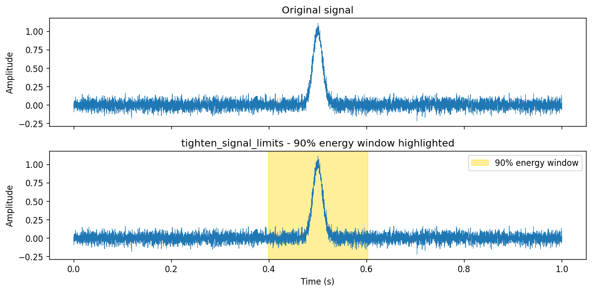
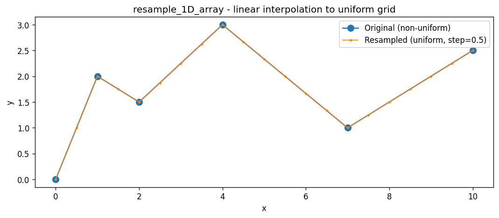
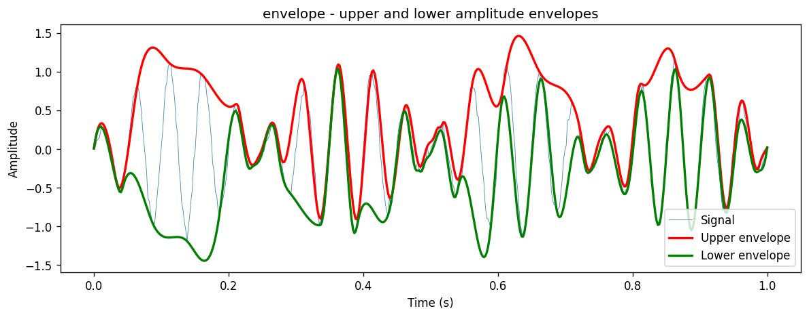

Tools Tutorial
==============

.. contents:: Contents
   :local:
   :depth: 2

The :mod:`ecosound.core.tools` module provides a collection of general-purpose
signal-processing and file-handling utilities used throughout ecosound.

.. code-block:: python

   import numpy as np
   from ecosound.core import tools

list_files
----------

:func:`~ecosound.core.tools.list_files` returns a sorted list of all files
matching a given extension under a directory.  Set ``recursive=True`` to search
subdirectories as well.

.. code-block:: python

   wav_files = tools.list_files('data/wav_files', '.wav', recursive=False)
   print('WAV files found:')
   for f in wav_files:
       print(' ', os.path.basename(f))

   txt_files = tools.list_files('data/Raven_annotations', '.txt', recursive=False)
   print('Raven .txt files found:')
   for f in txt_files:
       print(' ', os.path.basename(f))

.. code-block:: text

   WAV files found:
     67674121.181018013806.wav
     AMAR173.4.20190916T061248Z.wav
     JASCOAMARHYDROPHONE742_20140913T084017.774Z.wav
   Raven .txt files found:
     67674121.181018013806.Table.1.selections.txt
     AMAR173.4.20190916T061248Z.Table.1.selections.txt

filename_to_datetime
--------------------

:func:`~ecosound.core.tools.filename_to_datetime` parses timestamps embedded in
filenames and returns a list of :class:`datetime.datetime` objects.  It
recognises several common hydrophone recorder naming conventions (AMAR, OceanSonics,
JASCO).

.. code-block:: python

   fnames = [
       'data/wav_files/AMAR173.4.20190916T061248Z.wav',
       'data/wav_files/67674121.181018013806.wav',
       'data/wav_files/JASCOAMARHYDROPHONE742_20140913T084017.774Z.wav',
   ]
   timestamps = tools.filename_to_datetime(fnames)
   for fname, ts in zip(fnames, timestamps):
       print(' ', os.path.basename(fname), '->', ts)

.. code-block:: text

     AMAR173.4.20190916T061248Z.wav -> 2019-09-16 06:12:48
     67674121.181018013806.wav -> 2018-10-18 01:38:06
     JASCOAMARHYDROPHONE742_20140913T084017.774Z.wav -> 2014-09-13 08:40:17.774000

normalize_vector
----------------

:func:`~ecosound.core.tools.normalize_vector` scales a 1-D array so that its
minimum maps to −1, its maximum to 1, and its mean to approximately 0.

.. code-block:: python

   vec = np.array([3.0, 1.0, -2.0, 5.0, -1.0])
   print('Input      :', vec)
   normed = tools.normalize_vector(vec)
   print('Normalized :', np.round(normed, 4))
   print('Mean       :', round(float(np.mean(normed)), 6), '(approx 0)')
   print('Max abs    :', round(float(np.max(np.abs(normed))), 6), '(approx 1)')

.. code-block:: text

   Input      : [ 3.  1. -2.  5. -1.]
   Normalized : [ 0.4737 -0.0526 -0.8421  1.     -0.5789]
   Mean       : 0.0 (approx 0)
   Max abs    : 1.0 (approx 1)

tighten_signal_limits
---------------------

:func:`~ecosound.core.tools.tighten_signal_limits` returns the sample indices
``[start, stop]`` of the shortest window that contains a given percentage of the
total signal energy.  This is the core helper used by
:meth:`Sound.tighten_waveform_window`.

.. code-block:: python

   rng = np.random.default_rng(42)
   t = np.linspace(0, 1, 8000)
   noise = rng.normal(0, 0.05, len(t))
   burst = np.exp(-((t - 0.5)**2) / (2 * 0.01**2))  # Gaussian burst at 0.5 s
   signal = noise + burst

   chunk = tools.tighten_signal_limits(signal, energy_percentage=90)
   print('Signal length   :', len(signal))
   print('chunk (90 pct)  :', chunk)
   print('Duration before :', len(signal), 'samples')
   print('Duration after  :', chunk[1] - chunk[0], 'samples')

.. code-block:: text

   Signal length   : 8000
   chunk (90 pct)  : [3190, 4819]
   Duration before : 8000 samples
   Duration after  : 1629 samples

   The original signal (top) and the 90 % energy window (gold shading, bottom)
   identified by ``tighten_signal_limits``.  The Gaussian burst near 0.5 s
   concentrates most of the energy in a short interval.

resample_1D_array
-----------------

:func:`~ecosound.core.tools.resample_1D_array` linearly interpolates a
non-uniformly sampled ``(x, y)`` pair onto a regular grid with a specified step
size.

.. code-block:: python

   x = np.array([0.0, 1.0, 2.0, 4.0, 7.0, 10.0])
   y = np.array([0.0, 2.0, 1.5, 3.0, 1.0, 2.5])
   xnew, ynew = tools.resample_1D_array(x, y, resolution=0.5)
   print('Original x      :', x)
   print('Original y      :', y)
   print('Resampled x[:8] :', xnew[:8])
   print('Resampled y[:8] :', np.round(ynew[:8], 3))

.. code-block:: text

   Original x      : [ 0.  1.  2.  4.  7. 10.]
   Original y      : [0.  2.  1.5 3.  1.  2.5]
   Resampled x[:8] : [0.  0.5 1.  1.5 2.  2.5 3.  3.5]
   Resampled y[:8] : [0.    1.    2.    1.75  1.5   1.875 2.25  2.625]

   Original non-uniform samples (circles) and the linearly interpolated
   uniform grid at step 0.5 (dots).

entropy
-------

:func:`~ecosound.core.tools.entropy` computes the spectral entropy of a
power-spectral-density vector.  High entropy indicates a broadband signal;
low entropy indicates a tonal (narrowband) signal.

.. code-block:: python

   flat   = np.ones(100, dtype=np.float64)        # flat spectrum → high entropy
   peaked = np.zeros(100, dtype=np.float64)
   peaked[50] = 100.0                              # single tone → low entropy

   H_flat   = tools.entropy(flat)
   H_peaked = tools.entropy(peaked)
   print('Flat spectrum entropy  :', round(H_flat, 4), ' (high = broadband)')
   print('Peaked spectrum entropy:', round(H_peaked, 4), '(low  = tonal)')

.. code-block:: text

   Flat spectrum entropy  : -6.6439  (high = broadband)
   Peaked spectrum entropy: 0.0 (low  = tonal)

.. note::

   The sign convention used here means more-negative values correspond to
   broader, more uniform spectra (higher information content in the
   Shannon sense).

derivative_1d
-------------

:func:`~ecosound.core.tools.derivative_1d` estimates the numerical derivative
of a 1-D array using finite differences.  Use ``order=1`` for the first
derivative and ``order=2`` for the second.

.. code-block:: python

   y = np.array([1.0, 3.0, 6.0, 10.0, 15.0])
   d1 = tools.derivative_1d(y, order=1)
   d2 = tools.derivative_1d(y, order=2)
   print('Input    :', y)
   print('1st deriv:', d1)
   print('2nd deriv:', d2)

.. code-block:: text

   Input    : [ 1.  3.  6. 10. 15.]
   1st deriv: [2. 3. 4. 5.]
   2nd deriv: [1. 1. 1.]

The output arrays are one (or two) elements shorter than the input because the
finite-difference operation requires adjacent samples.

find_peaks
----------

:func:`~ecosound.core.tools.find_peaks` returns the indices and values of local
maxima in a 1-D signal.  Pass ``troughs=True`` to find local minima instead.

.. code-block:: python

   x = np.array([0.0, 1.0, 3.0, 2.0, 4.0, 1.0, 2.0, 0.5])
   peak_idx,   peak_val   = tools.find_peaks(x)
   trough_idx, trough_val = tools.find_peaks(x, troughs=True)
   print('Signal     :', x)
   print('Peak idx   :', peak_idx,   '-> values', peak_val)
   print('Trough idx :', trough_idx, '-> values', trough_val)

.. code-block:: text

   Signal     : [0.  1.  3.  2.  4.  1.  2.  0.5]
   Peak idx   : [0, 2, 4, 6] -> values [0.0, 3.0, 4.0, 2.0]
   Trough idx : [0, 3, 5] -> values [0.0, 2.0, 1.0]

envelope
--------

:func:`~ecosound.core.tools.envelope` computes the upper and lower amplitude
envelopes of a signal by connecting its local maxima and minima via
interpolation.

.. code-block:: python

   rng2 = np.random.default_rng(0)
   t_env = np.linspace(0, 1, 500)
   carrier = np.sin(2 * np.pi * 20 * t_env)
   modulation = np.abs(np.sin(2 * np.pi * 2 * t_env)) + 0.1
   sig_env = carrier * modulation + rng2.normal(0, 0.05, len(t_env))

   env_high, env_low = tools.envelope(sig_env)
   print('Signal length  :', len(sig_env))
   print('env_high range :', round(float(env_high.min()), 3), 'to', round(float(env_high.max()), 3))
   print('env_low  range :', round(float(env_low.min()), 3),  'to', round(float(env_low.max()), 3))

.. code-block:: text

   Signal length  : 500
   env_high range : -0.908 to 1.461
   env_low  range : -1.445 to 1.036

   A 20 Hz carrier modulated at 2 Hz (blue) with its upper (red) and lower
   (green) amplitude envelopes computed by ``tools.envelope``.
